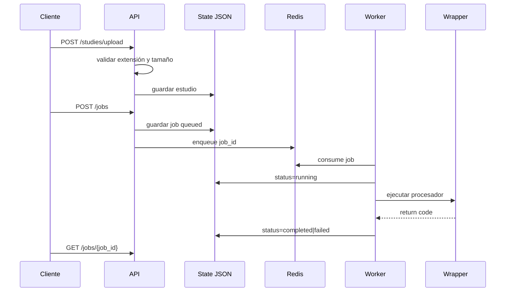

# Design: local-mri-processing-deployment

## Resumen

La solución se organiza en cuatro capas: API, servicios de dominio operativo, ejecución asíncrona y wrapper de integración clínica. Redis participa solo como broker; el estado canónico vive en disco.

## Decisiones de arquitectura

1. **FastAPI como control plane**
   - Racional: simple, moderno y suficiente para esta primera etapa.

2. **RQ sobre Redis**
   - Racional: menor complejidad que Celery para un sitio local con necesidades inmediatas.

3. **Estado JSON en disco**
   - Racional: evita introducir una base de datos antes de conocer necesidades reales y garantiza supervivencia a reinicios de Redis.

4. **Wrapper estable para el procesador**
   - Racional: desacopla la plataforma de la firma exacta del script clínico y preserva el código científico.

## Componentes

- `app/api/routes/health.py`
- `app/api/routes/studies.py`
- `app/api/routes/jobs.py`
- `app/services/validation.py`
- `app/services/storage.py`
- `app/services/state.py`
- `app/services/queue.py`
- `app/services/processor_runner.py`
- `app/workers/tasks.py`
- `processor/run_processor.py`

## Flujo principal

## Supuestos

- un solo worker es suficiente inicialmente;
- la integración real puede expresarse como comando CLI;
- el host provee almacenamiento persistente.

## Riesgos y mitigaciones

- **stdout/stderr sensibles**: se guarda solo tamaño, no contenido.
- **falta de PDF**: generación stub opcional.
- **Redis reiniciado**: JSON en disco conserva el historial.

## Validación

- pruebas automáticas básicas;
- revisión manual con Docker Compose;
- simulación de job completo en modo inline.
